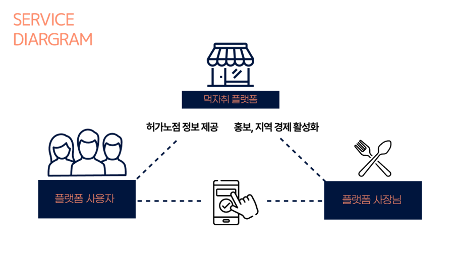
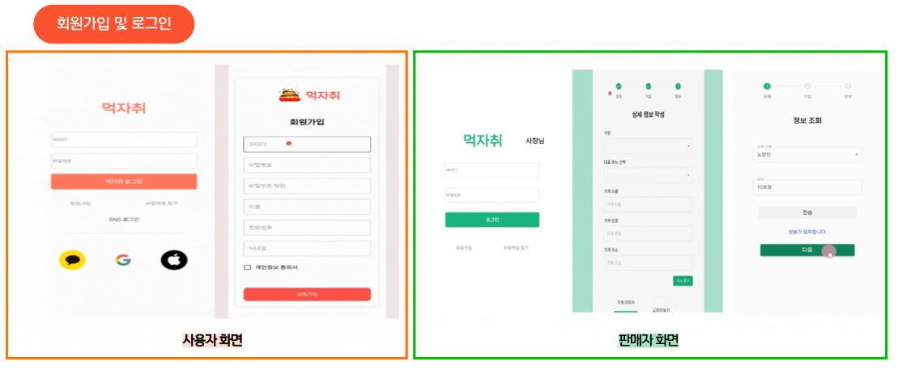
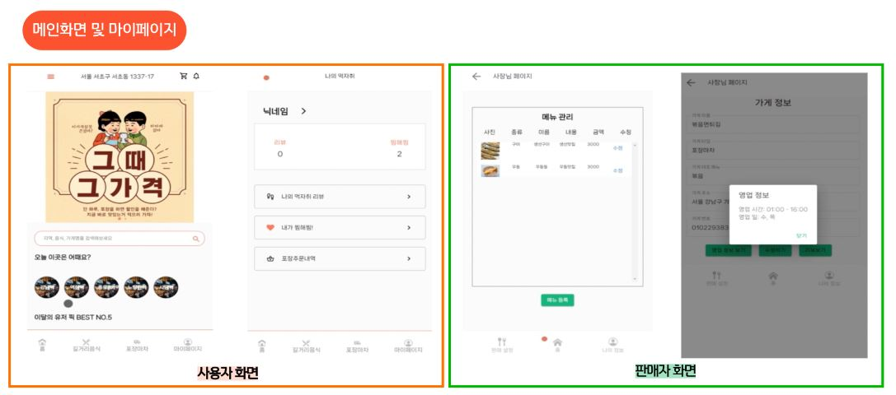
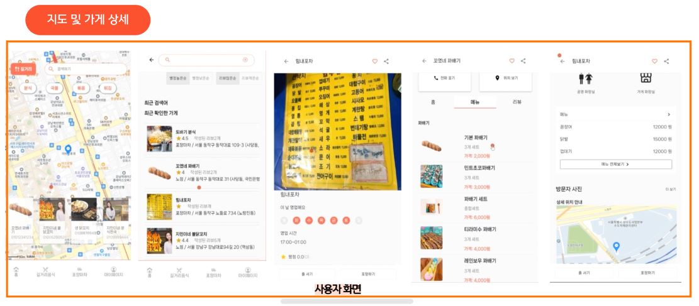

# mukjachi

## 프로젝트 시연 영상
  

## 목차
1. 개발배경
2. 기술스택
3. 주요기능
4. 팀소개
5. 기간 및 일정

## 개발배경
주변에서 쉽게 볼 수 있는 노점상과 포장마차들. 그러나 평소 접하던 가게가 아닌 경우 영업시간, 위치, 메뉴에 대한 정보를 알기는 쉽지 않습니다.

1. 포장마차의 위치와 관련정보를 실시간으로 제공해주는 서비스가 있으면 어떨까? 
2. 포장마차의 줄서기 예약과 포장 하는걸 쉽게 되었으면 좋겠어
3. 왜 내주위에는 노점상과 포장마차들이 없을까?

이 불편함을 해소하고자. 

“먹자취”를 개발하였습니다.

서비스목표 : 합법 노점상의 가치와 경쟁력 강화, 사용자 편의성 증대 및 사용자 경험 최적화, 사용자의 위치를 기반으로 실시간 정보 제공

## 비즈니스 모델 

## 활용기술
     

### 기술 선택이유
Socket.io	
Axios
Redis
node.js
jwt
mui
jenkins
docker

## 시스템 아키텍쳐

## 주요기능

## 팀 소개

