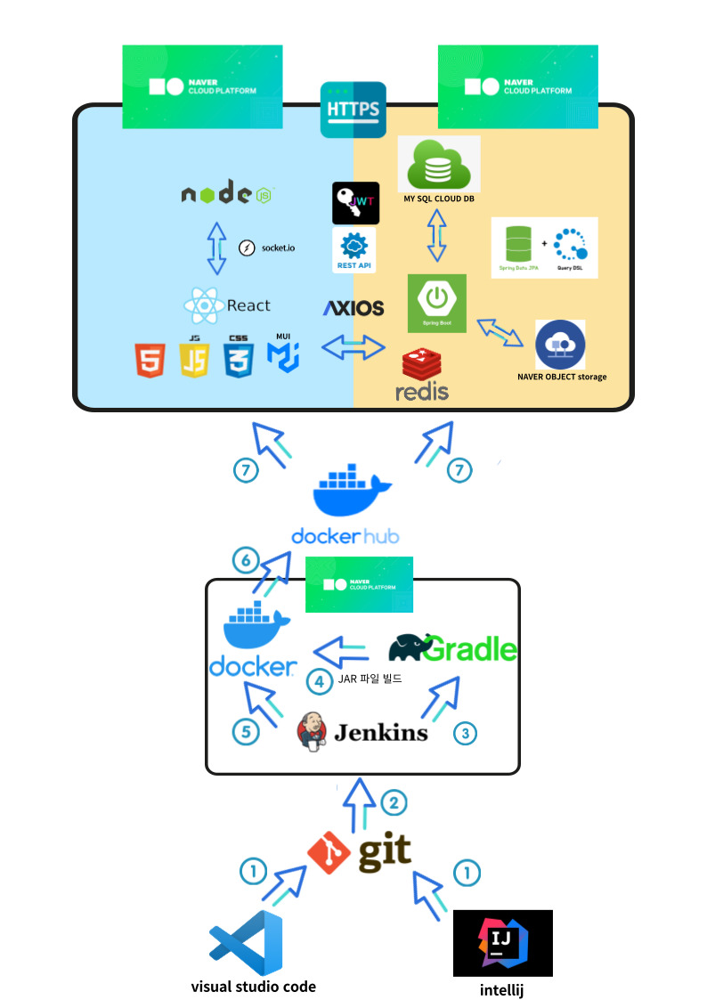

# mukjachi

## 프로젝트 시연 영상
  

## 목차
1. 개발배경
2. 기술스택
3. 주요기능
4. 팀소개
5. 기간 및 일정
## 개발배경
주변에서 쉽게 볼 수 있는 노점상과 포장마차들. 그러나 평소 접하던 가게가 아닌 경우 영업시간, 위치, 메뉴에 대한 정보를 알기는 쉽지 않습니다.
포장마차의 위치와 관련정보를 실시간으로 제공해주는 서비스가 있으면 어떨까? 이 불편함을 해소하고자. 
“먹자취”를 개발하였습니다.

서비스목표 : 합법 노점상의 가치와 경쟁력 강화, 사용자 편의성 증대 및 사용자 경험 최적화, 사용자의 위치를 기반으로 실시간 정보 제공

## 활용기술

## 시스템 아키텍쳐

## 주요기능
회원가입, 로그인 : muilti-step form 방식 
판매자와 유저 개별 로그인 기능

마이페이지 : 유저의 닉네임 변경, 작성 게시글, 결제내역, 즐겨찾기내역, 로그아웃 기능
지도 : 현재위치 기반으로 주변가게 정보 불러오기 및 주변 상업지역 추천 
가게정보 : 가게 위치 및 주소, 영업시간, 메뉴, 리뷰, 별점, 포장 가능 가게 표시 등 상세 정보 제공 
포장주문 및 결제 : 유저와 판매자간의 결제를 통한 상품 포장 기능
판매자 : 합법 노점 가게 등록 및 메뉴 등록,수정,삭제, 주문내역 확인, 소켓 io 방식 포장 기능
## 팀 소개

## 일정
